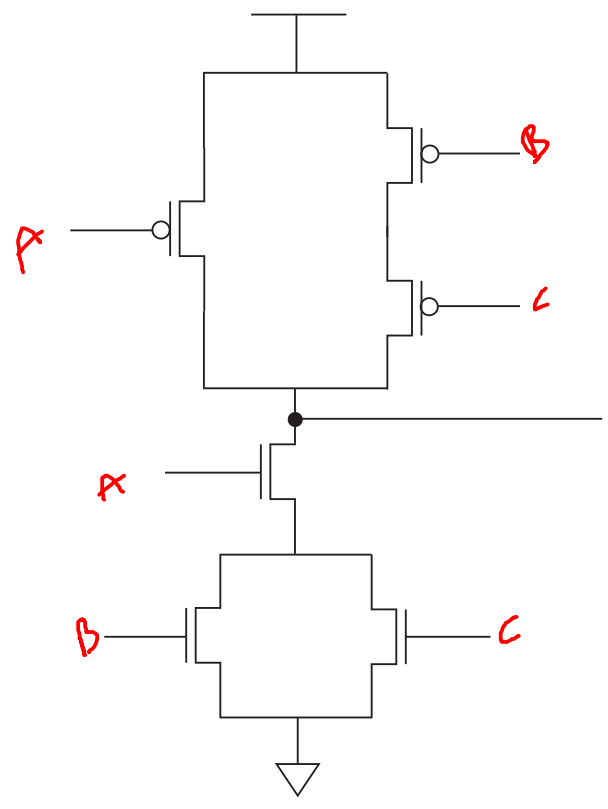
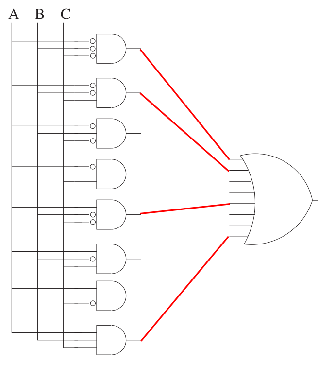
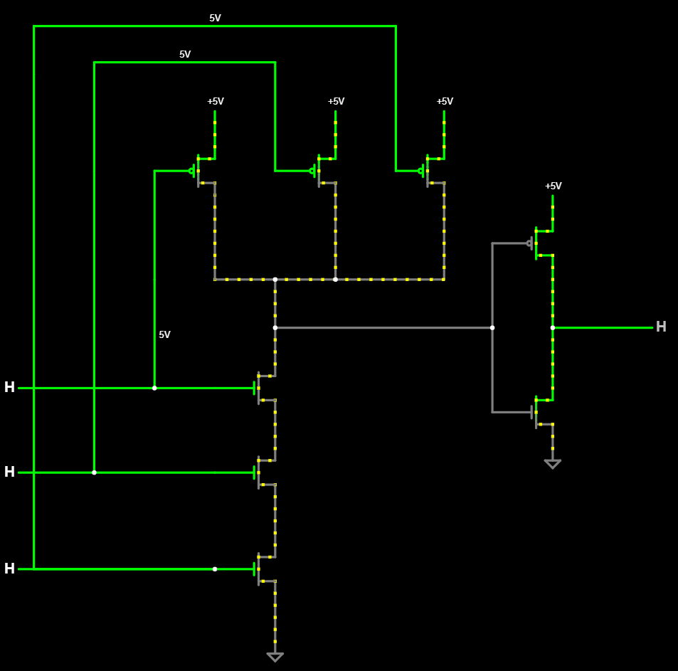
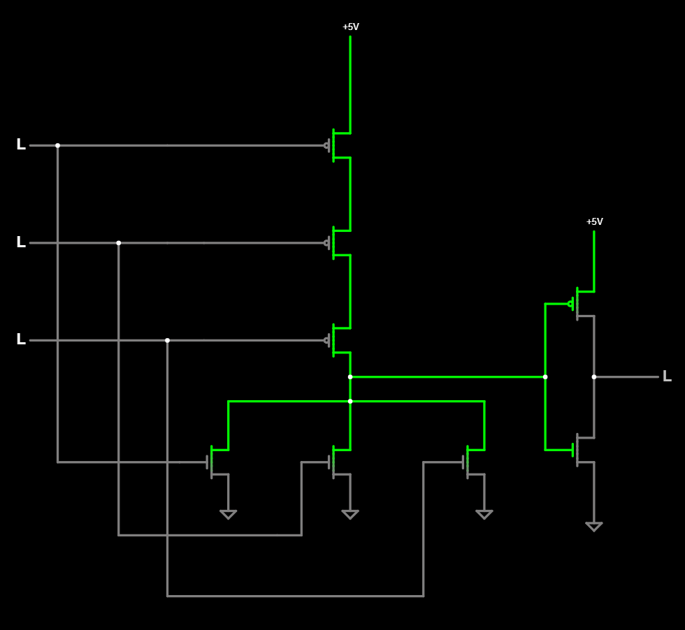
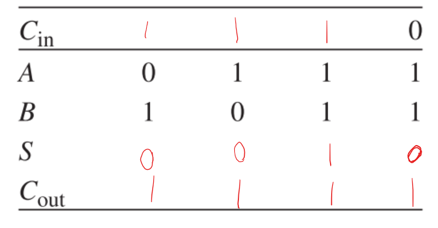
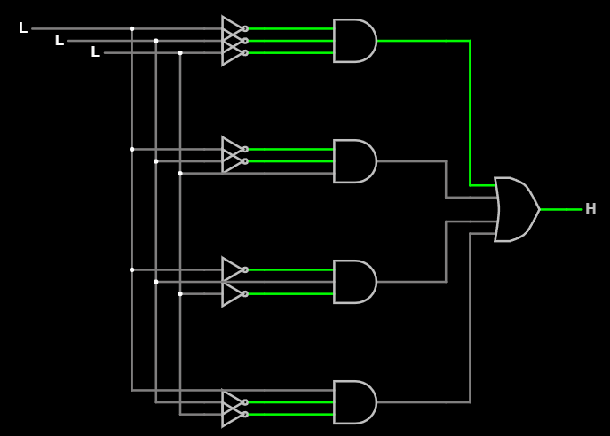
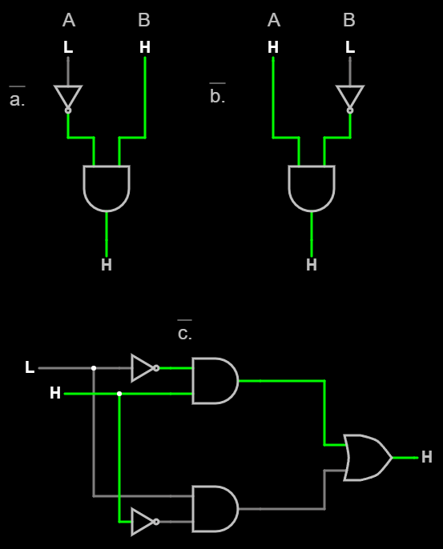
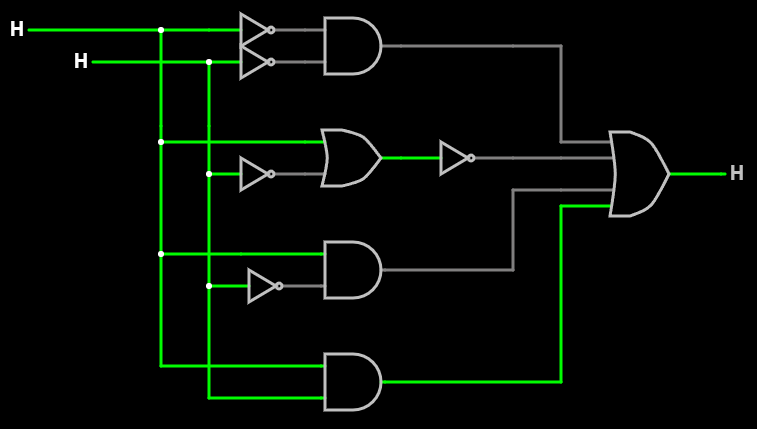
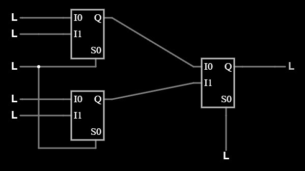

1. S
	1. n-type
		1. closed
		2. opened
	1. p-type
		1. opened
		2. closed
2. S
	1. top = P-type
	2. bottom = N-type
3. Every input can be 0 or 1. So there are total of 4 pair of possibility. And those pairs can produce 2 different outcomes (0 or 1). So 2^4 = 16 possible functions are possible.
4. S
	1. A = 0, B = 0, C = 1
	2. A = 1, B = 0, C = 0
	3. A = 0, B = 1, C = 0
	4. A = 1, B = 1, C = 0
5. S
	1. A = 0, B = 0, C = 0, OUT = 1
	2. A = 1, B = 0, C = 0, OUT = 1
	3. A = 0, B = 1, C = 0, OUT = 1
	4. A = 0, B = 0, C = 1, OUT = 0
	5. A = 1, B = 1, C = 0, OUT = 0
	6. A = 1, B = 0, C = 1, OUT = 0
	7. A = 0, B = 1, C = 1, OUT = 0
	8. A = 1, B = 1, C = 1, OUT = 0
6. S
	1. A B | C D Z
	2. 0 0   1 1 0
	3. 0 1   1 1 0
	4. 1 0   1 1 0
	5. 1 1   0 0 0
7. There is ambiguity at output when A = 1 and B = 1. Output voltage is threshold voltage, so it's keep switching.
8. 
9. When A supplied with 0, OUT will be 0. Otherwise OUT will be 1.
	1. [falstad link](https://www.falstad.com/circuit/circuitjs.html?ctz=CQAgjCAMB0l3BWcMBMcUHYMGZIA4UA2ATmIxAUgoqoQFMBaMMAKAHcQAWTvL4wiil6d+UdoOGiEQkNjycQKcZzACRa1SDx4qkZZu1UwkFAsNiOx01p3JrhBAL0AzCbPkhC1uQoTZw0EgwJuJeCtiEvGGK2hae1kK8YGhUiXHJcDFJKbKRYq7GGCjuChlUPhT+YIFQsEqWOZyZZRTciiwAsuA5CG1g2BgCvQqpgaHWTVTRw3HSkkMyhE3trnOey9FLtMXVQXXjvm2b1noc0214Um1KAObxCg4C0UW67RyXQxeiFada3x6FYoVJQFEwPRzdTKPQQBPYhBqZGYtLayFh3ZFFSFUHBOOLceZcTTqMQAGUJalEmGKxNezgAhgAbADOdGov1wCjS0TSvxaaTAnASsT0ACVwILObEwH4BDyoFxaPLdGMgA)
10. A = 0, B = 0, C = 1, D = 1, E = 1, F = 0
11. When A supplied with 0, Out will be 1. Otherwise OUT will be 0.
12. 
13. It depends on what IR value is. If it is 0 then OUT is 0, otherwise it is 1.
14. 0, 1, 1, 0, 1, 0, 0, 1
15. 0, 0, 0, 1. AND
16. 1, 0, 0, 0
17. S
	1. AND [falstad link | Live Circuit](https://www.falstad.com/circuit/circuitjs.html?ctz=CQAgjCAMB0l3BWcMBMcUHYMGZIA4UA2ATmIxAUgoqoQFMBaMMAKAHcLCrcAWTqnjzwgU7fiEHDCPAUKhihVMFwl5aKyArXjp6qpo4Y0FQSCMDp8jjO4oJcEITzCD9qk6kzHzq2eMIMQj93I3kAc2CzSD5zEDV9ETFY3kcvFNddEBTMsGI7VwQVFMKlDTEcvNSlQPkAJSrwU0zLBK8kBJgELVKBbWVfRXAg2P7RQ2N+kbL6+Ma+WZaoe2oO6C6OWbAa2fSk4xSd6IGHbDsbEAZT46pLu2cbq7G47VvnnrqQYlMwUy++RYEtCW+jWYj+4Bq4N2HChR0OfFcySckWhKORsR4V00ABlxJIssj8UoQAAzACGABsAM50FYsXGDEoE4RM4nk6m09r0hoeZneFzgUmUml08bcZFgODCbDI1yS-B8+XCFCFXxKxVS1T6Fgk5AKlVBSU+A0UbDgNZQWCiXXqwZG4SMuxgC0wSCier2kReT1bIKtIGrdbIY2hT0ylxiMMS-AOlosCKenjEQ0xkwIxIAWWD0olKCu4aWKFBusy+IxcgQTpdVp1DSZsSZlfN7RrJa8vNivKbzpbbtrTOU7m9KgQZp7lr7uqmVE2I7H1cnbyGVHBg9NzYnoiAA)
		1. 
	2. OR [falstad Link | Live Circuit](https://www.falstad.com/circuit/circuitjs.html?ctz=CQAgDOB0YzCsICMZICYaoOyYMxgByoBsAnCZiHBAlZQKYC0iiAUAGYgAsiRIqcvIgL7C4OJJAQowqdlyKcQOfIqG9lisRKnRZHTgsqJUINUZNbEkqDJYB3LjyUr5ijeHuPecY6-MeAJVNhVE4IMxJeCAgwynB4lDhPMywTMxwifA8HM05I4N4w6OTRVCyzAWKc0SJw0RITMBLvBpB8HAtWpuqWtOEzboLKVrze7K58uBH8gc92zpN5oaaOTDg0zEWO003KEysdWw4pjb7BXfXtGz0ubaJd0Z2LfetpWQdUkV5P+8bPH4ed12g243xCu34UU8oOcbku7kGOHhLiRJkwmXGqJA6KylWxGMGeJxwzRBM8J3xuNav3Ga1O2MuKiyIKcPhMMKZ4w5nCydLaPI8AHM2nd8FklrgonwWMKzJlysJJfFZMLHvKJrwlRB3kM8SRfHimgAZPgQkKhL4JEBsACGABsAM50OLGpTIxSoC0I+K2x3OqQsE0wtl8C0h6LW+1Ol2efUWWogON+QZJvW+WYcJMGRTkQqGSyvXRyJMRdG6l6HHW5ygJ6sKKqJst6ss84pBaucAXVrER2JSBKSFgAWUb3gTyAuCe1g+Fdd21b52pYQA)
		1. 
	3. AND
		1. A = 1, B = 0, C = 0, OUT = 0
		2. A = 0, B = 0, C = 0, OUT = 0
		3. A = 1, B = 1, C = 1, OUT = 1
	4. OR
		1. A = 1, B = 0, C = 0, OUT = 1
		2. A = 0, B = 0, C = 0, OUT = 0
		3. A = 1, B = 1, C = 1, OUT = 1
18. [falstad link | Live Circuit](https://www.falstad.com/circuit/circuitjs.html?ctz=CQAgjCAMB0l3BWcMBMcUHYMGZIA4UA2ATmIxAUgoqoQFMBaMMAKDEpEJQBYQ08QeQr35QQ2agjYcuvbIQFC5CsRNrSqsiikXDtAqmoobOPTnl28FB8WKntNZvNhSC9z14bsmtpV0pA-VW8HU15mFQCImyMpAEkKbnDiVy0wFLEYJHjEkXwwvnyqLOMEhCS+My0UM2LobJYyiuwEVLMWzyh60tzxFS15GxKc8t4EMDaxiczukYrRgoW6hqarCwLrGZXejEgrM13eZZ6FvDBCArOL47neIN8Mm8be5jx98LA3reNQtOxpqL-TqxFgAd16NSmrkhUDBEPy3DwVFEkDhSQE6VcC0xsPBCw6IHR4lauN6g0JSL6BjhAy+41c2C+qLx82mRPppK0rQEiNoOlJC0F0yWNKqGFcRMI4oFFU2vPM1JZvEOFGmKuZvSuhMRgnOnKcLgpVA8+t4bwEHPNpsCGAuRLI1zhCyC8qCGrScAt0zAnutzBJRP9nlFHxU8uiMo+dO9nyOIfAKGIdp1EyTpPDQIKYEz7rM2f5HPzitV0LMHMZcbx0wrJd6Go5Qtc6qdAJ1HObVf8be9vvrMejrh9RRbg5cXsHsfTlOzbOn52L4fnRsCjzRlJdlJNGvlJvlm23lLllO5U75PMp5IPhjDlJRaJTGSJBO3OoJ7OmL-H2oEUuD4Ml0pElqn66smAgOumOoQYG7B-t+CZpjBJKogAMvBOIwjixQgAAZgAhgANgAznQ1CocuoguMiRRiPhxGkUg5EcjC3BwJURy0YRJFkSwAAegh4OQaAXMQrGFMQhJ8EcAA0kCyXxAk-oJgTcBAJBUCI4SyfJ-EWBACD-IE2BjMZkm1NJYA6QJhgYBAxDYBI2AYLwmlQNprC6QQ4BgLZRlIMwzlmVplmorpGASaQ5D2YO8BBeA7kKRYFzOOB2ASW8ECuXJlkedZ4D-CJDn5ekcU5RZLBAA)
	1. 
19. Output of decoder can be calculated with number base as a base and input count as a exponent. Which in this case 2^5 = 32.
20. Just one output line. The number of select lines is the base-2 logarithm of the number of input lines. Which in this case 4.
21. S
	1. 
	2. Addition overflowed due to required one more bit.
22. [falstad link | Live Circuit](https://www.falstad.com/circuit/circuitjs.html?ctz=CQAgjCAMB0l3BWcMBMcUHYMGZIA4UA2ATmIxAUgoqoQFMBaMMAKDEpEJQBYQ08QeQr35QQ2agjYcuvbIQFC5CsRNrSqsiikXDtAqmoobOPTnl28FB8WKkBJCt15hiKUy7diYSB05H4HnyBVD7GjgjOfGZaKGah0L4sEVHYCO5aae4JSSnKApkqOeH+FGAZZgjl3oklkbz1QY3Ffo3WQe0tyaUYkFZmvbxdAO6lcQ3V41Aso42i3HhUopAzIM4Cru6Nm9OzqelrC+IHK3v5a4viRauZeBPu2He7pVXu62XZN5U6F7Q-py8oq9SgCtIQMG8juDPmdzAIFpoLM9GoMPiBUQDgVNgY8hqscU9gc18dVGsCMasEXDfvpnlT0vDLvIDJSmSoqctKUcdu8snSjnz3sCAULqu9odMADKHDZeXCebJiABmAEMADYAZzo1BW0o5gT5y2V6q1OpY0qxZm4cGiQ2Nmu1SBW7HceGIhDW2HcYEgVq9YgaxlGbo91qoIeCLOD7sjgj0nODemZcd43DAHoBSjW6cEMbTGdWEfeWfemb0xb0DOeRb0Ec6hZj7Sz9YAssg-d7IAhQ-6lokWEA)
	1. 
23.
	1. | A | B | C | D | Z |
	     | 1 | 1 | 0 | 0 | 1 |
	     | 0 | 1 | 0 | 1 | 1 |
	     | 0 | 0 | 1 | 1 | 1 |
	     | 0 | 0 | 1 | 1 | 1 |
	     | 0 | 1 | 1 | 1 | 1 |
	     | 1 | 0 | 1 | 1 | 1 |
	     | 1 | 1 | 0 | 1 | 1 |
	     | 1 | 1 | 1 | 0 | 1 |
	2. [falstad link | Live Circuit](https://www.falstad.com/circuit/circuitjs.html?ctz=CQAgjCAMB0l3BWcMBMcUHYMGZIA4UA2ATmIxAUgoqoQFMBaMMAKDEpEJQBYQUeQeQr368qYimw5de2QnkHCQcheKiT2VGRTApFvBLvUSEUrQMIJC+zlePrTmzgLxhrQ3q+traZ572JCKg8QQKofSQBJCm5eMGI9bXi9cOgkU2iEWOUERIFsXPUYdJZM7NyFbQqitKiY3nlKizxVKFqM+pAMPAaBboliuqzPOH9BUdSSsoCUJpnWwdMAd07kkG5A8ASoFhXtFDthvjtIXbGeWlm+bnCz-fwdPTRVO-y5dc3sd9O9gRvabL-HYrI4FPSGPRg4FjbA9ChXWFiV68bh4cSbVG3X4ozYQj7eM5HarEq4-MZE8rZMnabQbazaakWG6PTjMxkNDDgq6ETnQ7Q9BRHAV8lzYLkKPBi6FC0Z4tFYzr9fFdOFko4JBR00KkwnZYjlIz6pHY0LbdXbNXZA7WI5Ay0o2WU42dRqdI72zgtTrCj2kcHZH2Eq5kG1XSUpIMSqXVHkRkHc3kkl7xwVXaqI6UI+TwhQXaVGZ4sqFqoxQvFakt6LV44QKuWyoy1-N6I0s+XQrUa5VKsla2kYtEdgfo6zFs5aqET77jzZrKcEgAynWt60HK-CIAAZgBDAA2AGc6NRTkvqnnuEo8xudwej0gTyzC7Fcw8qBAb4fjywl1q51K1m+W57p+95SC2GA2tszDZggFpdNQyw2KIoQQZ0ZIhCoKE2kEOwALLgG4gpQSg0ZwSgaRnCEeIhhQqHoUoljWDRsFxjYXhYZwr4ztYYD4JqmxdpWBGQAYhpUpGBHvNUNEeswhTmqxRzMCJLLKc6Sl8cqvFeqcThJLowRKMwaD2CUKxakqfYCLJvG9HEtk7NMkn0gIzDfG0Zk5s5qxgNOKwhGEHEMpRRkGUFbISRm6bZr62TaK2pyZMGqHxXRHmSCC2TaXMyA6aUPmFPphSTJIQA)
		1. 
24. [falstad link | Live Circuit](https://www.falstad.com/circuit/circuitjs.html?ctz=CQAgjCAMB0l3BWcMBMcUHYMGZIA4UA2ATmIxAUgoqoQFMBaMMAKABkQUUAWEQ3rr254oogGYBDADYBnOtUgsAkpx58BasISo7oSBCzCVOGFOG0mzKPCKpn9LAO6reWuwkLmdTzja8hsNH9FDkCqNwCg4VEISVl5JEUAWUtfEUwzMNEUPRYAD3AECDAgsAxilGw+Tl4JaHyQbkhirUaUFuJqtQAjeoL28nbObCq1AV4AQQbsZk4IQMGhGpAAIQaPQYgEPFGltTWC7hw5xrxOseWplIRrNIpbrLtc5wRuVwsEDE8IxWdhcI+JWChmMNxEETBdzs1AMHH+6lOVGi4RAcTkCmUFC+CM+3wsugcHFxOOxyPE0nRiR88Ii8P4UBBVGwN0a9O4bPp0IcRiZLMIY3p-N40NomOsIjeImZZklohgDhU4vUvLM-B0UD0FB80r4+Du2ls2pZ8KV8N+rKE9NeluFIPsbwoFkIHkd6vsWpSzs8HiohFMruyzwoDvZvGtwdtf0FanDQoZLwdcfDxPNKBdBv1etT6b1ac8suz+eipuRPlNeDsfjVDI45bserN4FRFISNc4LtlZSLtnJ8QxBWwhAg3CB2AwnRHSE8agAxvUgA)
	1. 
	2. If we use same copy of *c* part, the carry will be lost.
25. Solution;
	1. The first figure is a *mux*, used to select one of the inputs. The selected output will not be stored.
	2. The second figure is an *R-S Latch*, used to store the binary value inside. The output will be stored.
26. [faltsad link](https://www.falstad.com/circuit/circuitjs.html?ctz=CQAgjCAMB0l3BWcMBMcUHYMGZIA4UA2ATmIxAUgoqoQFMBaMMAKABkRtC8QU8eUKACy9+UcCABmAQwA2AZzrVI7EELCFOaUT2zaqEGQqVIVYShTApOkEYXw2RVa7RbnrGbmr0hifby5q1AgsAO4gnrq2EV5CcFAsALK+-kI+xEIiaYEo0CHhXAJihZx4TmFqGlpU6prYZQkAkpWa2ZbWbVQwSPntavElcV0VgwNe9eXhtaVZVZ0szfY80xja0115FG4I1ghWLSBLB87BFdNt0wiZCQWxYzx7LmdCD-sljzcUfhT+q7T+KnCf0cMSikwiayqkWOFWBmR40Phn2BOwRaxeCXM-we-gQ31R4kCIWal2uBKuTigm16SI+5P2gMODlwImBLKaBz0tDe+ipPQWBz4r2sQvE3S2UyqopKorMFgJhDiX2siq6vFO4TxKqV0NVyK8esRis+7zeBuEJvNIgVFsZpNmmkICE0dqqTs0CudCSAA)
	1. 
27. 14 bit address can store 2^14 byte. If the nibble takes half the space of the byte, this memory can store 2^14 * 2 = 2^15 nibbles.
28. [falstad link | Live Circuit](https://www.falstad.com/circuit/circuitjs.html?ctz=CQAgjCAMB0l3BWcMBMcUHYMGZIA4UA2ATmIxAUgoqoQFMBaMMAKDDwBYQPCvsEUFQlX6CqrAO7deIbJ25hCs+ZBZSefAcs1iWAGW2yt2QniNioIAGYBDADYBnOtVUGOiwybNyuVKrcdnJFcFJQQOPlMKCMt-eycXfUMEMEEvClTY63igqDVpLhS0+SK89RlwrncwmNV2KorMhGEMi0khES0MNG4OM1UpZtpM7qo+vxYAWRA8PDG+kGJMiP6QFGgENnlR3rMMeRXLdrwPQ9n5-vyBM0Pq3bKKFDNhG48Xh7v3u8OQ74X0n6WAIJYJJfaFGLgkCEFC+IE5RJAA)
	1. 
	2. | S0 | S1 | OUT |
	   | -  | -  | -  |
	   | 0  | 0  | LEFT TOP I0 |
	   | 1  | 0  | LEFT TOP OR BOTTOM I1 |
	   | 0  | 1  | LEFT BOTTOM I0 |
	   | 1  | 1  | LEFT BOTTOM I1 |