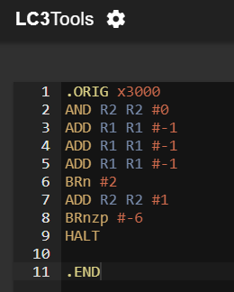

# Chapter 06

1. Yes, an algorithm is defined a step by step procedure that will terminate eventually. We can create a procedure that doesn't end with 3 basic constructs and won't be a algorithm. Here it is;
	1. x3000: AND R0 R0 #0
	2. x3001: BRZ #-1
---
2. Solution:
	1. a.
		1. Start
		2. Subtract 2 number
		3. Stop
	2. b.
		1. Start
		2. Initialize
		3. Subtract 2 number
		4. Stop
	3. c.
		1. Start
		2. Initialize
			1. R0 <- first number
			2. R1 <- second number
			3. R2 <- 0 (will be result)
		3. Operation
			1. NOT R1 R1
			2. ADD R1 R1 #1
			3. ADD R2 R1 R0
		4. Stop
---
3. Solution: 
	-	x4000: .FILL x0005	     ; Machine ID
	-	x4001: .FILL x3101	     ; Busy bitmask 
	-	x4002: 0101 000 000 1 00000  ; AND R0, #0
	-	x4003: 0001 000 000 1 00001  ; ADD R0, #1
	-	x4004: 0010 110 111111100    ; LD R6, x4001
	-	x4005: 0010 101 111111010    ; LD R5, x4000
	-	x4006: 0000 010 000000100    ; BRz x400B
	-	x4007: 0001 000 000 0 00 000 ; ADD R0, R0+R0
	-	x4008: 0001 101 101 1 11111  ; ADD R5, #-1
	-	x4009: 0000 010	000000001    ; BRz x400B
	-	x400A: 0000 111 111111100    ; BRnzp x4007
	-	x400B: 1001 000 000 111111   ; Not R0
	-	x400C: 0101 110 110 0 00 000 ; AND R6, R0
	-	x400D: 1001 000 000 111111   ; Not R0
	-	x400E: 0001 110 110 0 00 000 ; ADD R6, R6+R0
	-	x400F: 0011 110 111110001    ; ST R6, x4001
	-	x4010: 1111 0000 00100101    ; TRAP, x25
	- Assembly: 

---
4. Solution:
	1. LDI R1 SEC_NUM
	2. LDI R2 FRS_NUM
	3. AND R0 R0 #0
	4. NOT R4 R2
	5. ADD R4 R4 #1
	6. ADD R5 R1 R4
	7. BRn #4
	8. BRp #1
	9. BRnzp HALT
	10. ADD R0 R0 #1
	11. BRnzp HALT
	12. ADD R0 R0 #-1
	13. HALT
---
5. 88 * 3. Because it needs less operation count.
---
6. Solution:
	1. Flowchart:

	2. Assembler code in image:

	3. Actual assembler code:
		AND R3 R3 #0
     		ADD R6 R0 #0
		ADD R7 R1 #0
		AND R4 R7 #-1
       		BRz DONE
      		AND R4 R6 #-1
		BRz DONE
       		BRn NEG1
       		AND R4 R7 #-1
       		BRp POS2
      		NOT R7 R7
       		ADD R7 R7 #1
      		BRnzp NMULT
	NEG1    NOT R6 R6
     		ADD R6 R6 #1
       		AND R4 R7 #-1
      		BRn POS1
	NMULT   NOT R2 R6
      		ADD R2 R2 #1
       		ADD R4 R7 R2
      		BRn COUNT1
		ADD R5 R6 #0
	LOOP1   ADD R3 R3 R7
     		ADD R5 R5 #-1
      		BRp LOOP1
      		NOT R3 R3
      		ADD R3 R3 #1
       		BRnzp DONE
	COUNT1  ADD R5 R7 #0
	LOOP2   ADD R3 R3 R6
      		ADD R5 R5 #-1
      		BRp LOOP2
		NOT R3 R3
      		ADD R3 R3 #1
		BRnzp DONE
	POS1    NOT R7 R7
      		ADD R7 R7 #1
	POS2    NOT R2 R6
      		ADD R2 R2 #1
      		ADD R4 R7 R2
      		BRn COUNT2
      		ADD R5 R6 #0
	LOOP3   ADD R3 R3 R7
      		ADD R5 R5 #-1
      		BRp LOOP3
      		BRnzp DONE
	COUNT2  ADD R5 R7 #0
	LOOP4   ADD R3 R3 R6
      		ADD R5 R5 #-1
      		BRp LOOP4
     		BRnzp DONE
	DONE    TRAP x25
    .END
---
7. It sums correspending elements of specific lengthed two list and store them.
- Assembly code for LC-3tools:
   .ORIG x3001
        LEA R0 #12
        LEA R1 #16
        AND R2 R2 #0
        LD R2 #19
        LDR R3 R0 #0
        LDR R4 R1 #0
        ADD R3 R3 R4
        STR R3 R0 #0
        ADD R0 R0 #1
        ADD R1 R1 #1
        ADD R2 R2 #-1
        BRp #-8
        TRAP x25
        .FILL x0005
        .FILL x0004
        .FILL x0003
        .FILL x0006
        .FILL x0002
        .FILL x0004
        .FILL x0007
        .FILL x0006
        .FILL x0008
        .FILL x0007
        .FILL x0005
   .END
---
8. R2 might be populated previously and result might be incorrect due to this.
---
9. Solution:
	1. x3001 0010 000 0 0000 0101 ( LD R0, Z )
	2. x3002 0010 001 0 0000 0101 (	LD R1, ONE_HUND )
	3. x3003 1111 0000 0010 0001 ( DISPLAY TRAP x21 )
	4. x3004 0001 001 001 1 11111 ( ADD R1, R1, #-1 )
	5. x3005 0000 001 1 1111 1101 ( BRp DISPLAY )
	6. x3006 1111 0000 0010	0101 ( TRAP x25 )
 	7. x3007 0000 0000 0101 1010 ( Z .FILL x005A )
  	8. x3008 0000 0000 0110 0100 ( ONE_HUND .FILL X0064 )
	- Assembly code for LC-3tools:
	.ORIG x3001
            LD R0 Z
            LD R1 ONE_HUND
DISPLAY     TRAP x21
            ADD R1 R1 #-1
            BRp DISPLAY
            TRAP x25
Z           .FILL x005A
ONE_HUND    .FILL x0064
	.END
---
10. Solution:
-	x3000	0010 010 000001000		(	LD R2, NUMBER )
-	x3001	0101 011 010 1 00001		(	AND R3, R2, #1 )
-	x3002	0000 010 000000011		(	BRz EVEN )
-	x3003 	1110 000 000000110		(	LEA R0, ODD_STRING )
-	x3004	1111 0000 0010 0100		(	TRAP x24 )
-	x3005	1111 0000 0010 0101		(	TRAP x25 )
-	x3006	1110 000 000001001		(	LEA R0, EVEN_STRING )
-	x3007	1111 0000 0010 0100		(	TRAP x24 )
-	x3008	1111 0000 0010 0101		(	TRAP x25 )
-	x3009 	0000 0000 0110 1101		( NUMBER		#109)
-	x300A	0011 0010 0101 0010		( ODD_STRING	x3252  ; ASCII 52 – ‘R’, 32 – ‘2’ )
-	x300B 	0110 1001 0010 0000		( x6920		; ASCII 20 – “space”, 69 – ‘i’ )
-	x300C	0010 0000 0111 0011		( x2073		; ASCII 73 – ‘s’, 20 – “space” )
-	x300D	0110 0100 0110 1111		( x646F		; ASCII 6F – ‘o’, 62 – ‘d’ )
-	x300E	0000 1010 0110 0100		( x0A64	; ASCII 64 – ‘d’, 0A – “line feed” )
-	x300F	0000 0000 0000 0000		( x0000		; PUTSP string termination )
-	x3010	0011 0010 0101 0010		( EVEN_STRING	x3252  ; ASCII 52 – ‘R’, 32 – ‘2’ )
-	x3011 	0110 1001 0010 0000		( x6920		; ASCII 20 – “space”, 69 – ‘i’ )
-	x3012	0010 0000 0111 0011		( x2073		; ASCII 73 – ‘s’, 20 – “space” )
-	x3013	0111 0110 0110 0101		( x7665		; ASCII 65 – ‘e’, 76 – ‘v’ )
-	x3014	0110 1110 0110 0101		( x6E65		; ASCII 65 – ‘e’, 6E – ‘n’ )
-	x3015	0000 0000 0000 1010		( x000A	; ASCII 0A – “line feed” )
-	x3016	0000 0000 0000 0000		( x0000		; PUTSP string termination )
-	I added the display of approptiate string to see is a value in R2 even or odd.
-	
-	You can also do it using TRAP x22 and .STRINGZ command, but this uses 2 times more memory locations:
-	
-	Assembly code:
-	.ORIG x3000
            LD R2 NUMBER
            AND R3 R2 #1        ;Even|odd check
            BRz EVEN        
            LEA R0 ODD_STRING   ;Put the string "R2 is odd" to R0
            PUTSP               ;Display the string
            HALT                ;Stop the programm
EVEN        LEA R0 EVEN_STRING  ;Put the string "R2 is even" to R0
            PUTSP               ;Display the string
            HALT                ;Stop the programm
NUMBER      .FILL #109          ;Put here any number to check
ODD_STRING  .FILL x3252         ;String "R2 is odd"
            .FILL x6920
            .FILL x2073
            .FILL x646F
            .FILL x0A64
            .FILL x0000
EVEN_STRING .FILL x3252         ;String "R2 is even"
            .FILL x6920
            .FILL x2073
            .FILL x7665
            .FILL x6E65
            .FILL x000A
            .FILL x0000
.END

---
11. Solution:
-	x3000 	0010 000 011111111		( 	LD R0, x3100 )
-	x3001 	0010 001 011111111		( 	LD R1, x3101 )
-	x3003 	1001 010 000 111111		( 	NOT R2, R0 )
-	x3004 	0001 010 010 1 00001		( 	ADD R2, R2, #1 )
-	x3005	0001 011 001 0 00 010		( 	ADD R3, R1, R2 )
-	x3006	0001 100 000 1 00000		( 	ADD R4, R0, #0 )
-	x3007	0110 101 100 000000		( L 	LDR R5, R4, #0 )
-	x3008	0001 101 101 1 00001 		( 	ADD R5, R5, #1 )
-	x3009	0111 101 100 000000		( 	STR R5, R4, #0 )
-	x300A 	0001 100 100 1 00001		( 	ADD R4, R4, #1 )
-	x300B	0001 011 011 1 11111		(	ADD R3, R3, #-1 )
-	x300C	0000  011 111111010		(	BRzp L )
-	x300D	1111 000000100101		(	TRAP x25 )
-	In the assembly code i did bigger range of memory locations for illustration:
-	
-	Actual code:
-	.ORIG x30E0
        LD R0 PTR1
        LD R1 PTR2
        NOT R2 R0
        ADD R2 R2 #1
        ADD R3 R1 R2    ; count register
        ADD R4 R0 #0    ; register to traverse through each memory location
LOOP    LDR R5 R4 #0
        ADD R5 R5 #1
        STR R5 R4 #0
        ADD R4 R4 #1
        ADD R3 R3 #-1
        BRzp LOOP
        TRAP X25 
PTR1    .FILL x3100      ; Holds address x3100 
PTR2    .FILL x3109      ; Holds address x3109
.END

---
12. Solution:
- Part A is trivial, so here is the part B:

- Actual assambly code:
- .ORIG x3000
        LD R1 ENTER
        NOT R1 R1
        LD R2 SAVE_STRING
        LD R4 TERMINATION
LOOP    TRAP x23                ;IN - takes the key from the keyboard, echoes onto the console, saves to R0 
        STR R0 R2 #0            ;stores the character to the memory location
        ADD R2 R2 #1            ;increments the address to save the next character if any
        AND R3 R1 R0            ;checks for the Enter input
        BRnp LOOP               ;Loops until Enter is pressed
        STR R4 R2 #0            ;stores the termination code to denote the end of the string for the PUTS command
        LD R0 SAVE_STRING       ;saves the first memory location of the beginning of the string
        TRAP x22                ;PUTS - displays the string onto the console
        TRAP x25
ENTER           .FILL x000A     ; Enter ASCII code
SAVE_STRING     .FILL x3100     ; Beginning of the string
TERMINATION     .FILL x0000     ; Termination of the string code
.END
---
13. Solution:
- In comparison with the textbook solution, mine avoids using a mask by employing a separate register to store shifts.
-
- Actual assambly code:
- .ORIG x3000
            AND R2 R2 #0
            ADD R2 R2 #15   ; counter register
            AND R3 R3 #0    ; register for shifting save
            LD R1 NUMBER    ; register for shifting
            BRz DONE        ; stop program if initial number is x0000
            BRn NEGATIVE    ; add 1 to least significant bit (LSB) at R3 if MSB (most SB) is 1 at R1
            BRp POSITIVE    ; add 0 to least significant bit (LSB) at R3 if MSB (most SB) is 0 at R1
LOOP        ADD R1 R1 R1
            BRn NEGATIVE
POSITIVE    ADD R3 R3 R3
            ADD R2 R2 #-1
            BRnp LOOP       ; loop until R2 isn't equal to 0
            BRz DONE
NEGATIVE    ADD R3 R3 R3
            ADD R3 R3 #1
            ADD R2 R2 #-1
            BRnp LOOP       ; loop until R2 isn't equal to 0
DONE        ST R3 NUMBER    ; store the shifted number
            TRAP x25
NUMBER          .FILL x8421 ; Number to shift
.END
---
14. 9,10,11.
- 
- Code:
.ORIG x3000
AND R2 R2 #0
ADD R1 R1 #-1
ADD R1 R1 #-1
ADD R1 R1 #-1
BRn #2
ADD R2 R2 #1
BRnzp #-6
HALT
.END
---
15. STR R2 R4 #7
---
16. Solution:

-	x3000	0010 000 000000100   		( LD R0 #4 )   		; R0 = 48
-	x3001	0001 000 000 1 00001		( ADD R0 R0 #1 )	; R0 = 49
-	x3002	1011 000 000000011		( STI R0 #3 )		; stores 49 at x4001
-	x3003	0110 001 000 110000		( LDR R1 R0 #-16 )	; loads the content of x0021 to R1
-	x3004	1111 000 0010 0101		( TRAP x25 )
-	x3005	0000 0000 0011 0000		( #48 )
-	x3006	0100 0000 0000 0001		( x4001 )
- There are a lot of options at x3003 with LDR or STR instructions and different destination registers, but R0 #-16 should be the same!
---
17. JSR #15. The description of this instruction is in the appendix A. "The LC-3 ISA" page 691. 
---
18. Solution:
- 
- 
- Actual code:
	.ORIG x3000
            AND R3 R3 #0
            LDI R1 NUMERATOR
            BRz DONE
            BRn NEG1
            LDI R2 DIVIDER
            BRz DONE
            BRp POS1
            BRn NEG3
NEG1        LDI R2 DIVIDER
            BRz DONE
            BRn NEG2
            BRp NEG4
NEG3        ADD R4 R1 R2
            BRn DONE1
            ADD R1 R1 R2
            ADD R3 R3 #1
            BRnzp NEG3
DONE1       NOT R3 R3
            ADD R3 R3 #1
            NOT R1 R1
            ADD R1 R1 #1
            BRnzp DONE
NEG4        ADD R4 R1 R2
            BRp DONE2
            ADD R1 R1 R2
            ADD R3 R3 #1
            BRnzp NEG4
DONE2       NOT R3 R3
            ADD R3 R3 #1
            BRnzp DONE
NEG2        NOT R1 R1
            ADD R1 R1 #1
            BRnzp LOOP
POS1        NOT R2 R2
            ADD R2 R2 #1
LOOP        ADD R4 R1 R2
            BRn DONE
            ADD R1 R1 R2
            ADD R3 R3 #1
            BRnzp LOOP
DONE        STI R3 QUOTIENT
            STI R1 REMINDER
            TRAP x25
NUMERATOR   .FILL x4000 
DIVIDER     .FILL x4001
QUOTIENT    .FILL x5000
REMINDER    .FILL x5001
    .END
    .ORIG x4000
        .FILL #-9 ; numerator
        .FILL #3  ; divider
    .END
---
19. 	The bugs are:
	1.	The instruction at x3000 should be 0010 0000 0000 1010
	2.	The instruction at x3004 should be 0001 0100 1010 0100
	3.	The instruction at x3008 should be 0000 1111 1111 1001
	4.	The instruction at x3009 should be 0111 0100 0100 0000
    	- Code without bugs:
    	
	- Assambly code :
.ORIG x3000
        LD R0 #10       ;x4000
        LD R1 #10       ;x5000
UP      LDR R2 R0 #0
        BRz #5
        ADD R2 R2 #4
        STR R2 R1 #0
        ADD R0 R0 #1
        ADD R1 R1 #1
        BRnzp UP
        STR R2 R1 #0
        TRAP x25
    .FILL x4000 
    .FILL x5000
.END
.ORIG x4000
    .FILL x004D     ; ASCII 'M'
    .FILL x0061     ; ASCII 'a'
    .FILL x0074     ; ASCII 't'
    .FILL x0074     ; ASCII 't'
    .FILL x0000     ; end of the string
.END
	- The actual encrypted message at x5000 is 'Qexx', not 'Qeyy' as claimed in the textbook.

---
20. Solution 18 already works for all integers, not just positive integers.
---
21. Solution:
	- 
---
22. Solution:
	-
	- If password stored as negative number, instructions at x3006 and x3007 can be removed.
---
23. Solution: R0 = A52D, R1 = 1010
    |    PC    |  MAR  |  MDR   |    IR     |    R0    |     R1    |
    | ---------- | ---------- | ---------- | ---------- | ---------- | ---------- |
    | x3000 | ---------- | ---------- | ---------- | x0000 | x0000 |
    | x3001 | x3006 | xB333 | x2005 | xB333 | x0000 | 0010 0000 0000 0101 : LD R0 #5
    | x3002 | x3001 | x0601 | x0601 | xB333 | x0000 | 0000 0110 0000 0001 : BRzp #1
    | x3003 | x3002 | x1261 | x1261 | xB333 | x0001 | 0001 0010 0110 0001 : ADD R1 R1 #1
    | x3004 | x3003 | x1000 | x1000 | x6666 | x0001 | 0001 0000 0000 0000 : ADD R0 R0 R0
    | x3005 | x3004 | x0BFC | x0BFC | x6666 | x0001 | 0000 1011 1111 1100: BRnp #-4
---
24. 0110 0000 0100 0001: LDR R0 R1 #1
---
25. at this point assembly coding has not yet been taught. but since the operation is done through registers and there is no memory access, the answer will be like this: the answer will result = result + 1 because the necessary bit insertion has not been done.
---
26. Solution:
	1. a.
	    | Cycle |  State  |  Bus   |    Signals     |
	    | --------- | ---------- | ---------- | ---------- |
	    |     T    | ---------- | x3010 | LD.MAR = 1, LD.PC =1, PCMux = PC + 1, GatePC = 1 |
	    |  T+4  | ---------- | xA202 | LD.MDR = 1, Gate.MDR = 1, LD.IR = 1 |
	    |  T+6  | ---------- | x3013 | ADDR1MUX = PC, ADDR2MUX = SEXT(IR[8:0]), MARMUX = ADDR.ADD, Gate.MARMUX = 1 |
	    | T+10 | ---------- | x4567 | LD.MAR = 1, MDRMUX = Memory, LD.MDR = 1 |
	    | T+14 | ---------- | x0000 | LD.REG = 1, LD.CC = 1, GateMDR = 1, DR = 001 |
	2. LDI R1 #2
	3. x3010
	4. 3 clock cycles
	5. e.
		1. x3010 = xA202
		2. x3013 = x4567
		3. x4567 = 0
---
27. Solution:
	

