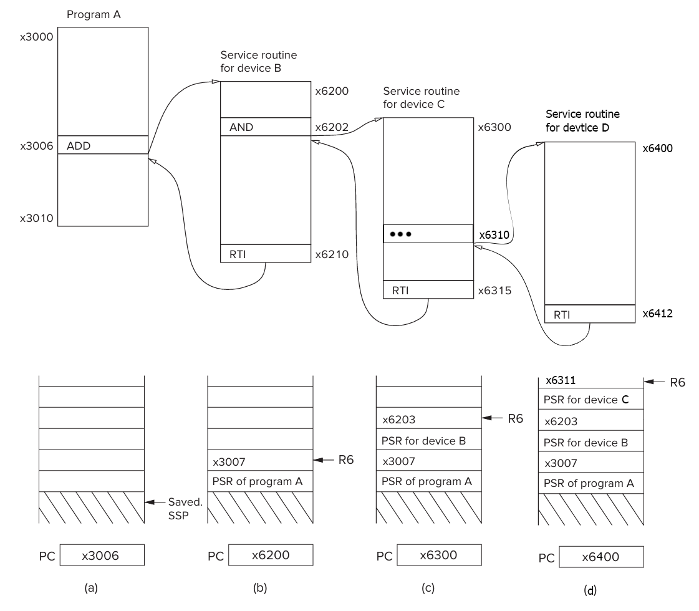
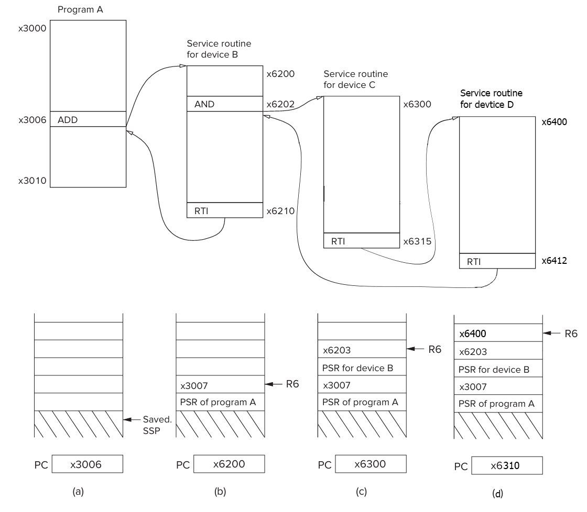

# Chapter 09

1. Solution:
   1. Device register is a register for used I/O operations of that specific I/O device.
   2. Device data register is a register that holds relevant data of that specific I/O device. It uses for storing or loading data from/to device.
   3. Device status register is a register that holds operational status of that specific device. That stores information of availability or state of the operation. It needed for synchronization of I/O device and processor.
---
2. Because if synchronous I/O is used, processor will always be ready for new data from I/O device at the moment when I/O device send new data, so there is no need for ready bit.
---
3. At least 303030304/minute.
---
4. Solution:
   1. Synchronous
      1.
   2. Asynchronous
   3. Synchronous
   4. If the subject of the interaction is able to respond to the interaction instantaneously, we are talking about a synchronous interaction. but if the response of the subject to the interaction depends on a cue left by the first subject, this is an asynchronous interaction.
---
5. It is ready bit of keyboard device. It represents validity the current value of KBDR. If KBSR[15] is 1 that means value in KBDR is the ASCII code of last struck key, if it is 0 that means value in KBDR is not valid.
---
6. It can re-read data that has already been read on the previous input.
---
7. Memory mapped and polling. Memory mapped because KBDR load/saved from a specific address and processor continuously checks the KBSR value to see if there has been an input.
---
8. Solution:

```assembly
         .Orig x4000
VALUE       .FILL x0021      
        LD  R0 VALUE
        LD  R2 NEG_MASK
        AND R2 R0 R2    ; is it negative?
        BRn EXIT        
        LD  R2 VALID_SYMB
        ADD R2 R0 R2    ; is ASCII code a symbol?
        BRnz EXIT       
        LD  R2 CHECK
        ADD R2 R0 R2    ; is it higher than x7F?
        BRp EXIT        
        TRAP x21        ; print the value
EXIT    HALT

CHECK       .FILL xFF82     ;negative x007E
VALID_SYMB  .FILL xFFE0     ;-32
NEG_MASK    .FILL x8000     ;negative mask
    .END
```

---
9. It may overwrite input that previously entered and not processed by the processor yet.
---
10. It may overwrite output that previously send and not showed the user yet.
---
11. Interrupt-driven way more efficient. Because in polling, processor have to constantly check for specific register (ready bit) for that I/O device to not miss any I/O operation from that device and this costs lots of processor cycle. But in interrupt-driven it doesn't have to that. Instead, it's just doing other instructions until get an interrupt signal from I/O device.
---
12. Solution:

```assembly
START   LDI     R0, KBDSR   ;Test for
        BRz     START       ;character input
        AND     R1, R1, #0
        STI     R1, KBDSR
        BRnzp   NEXT_TASK   ;Go to the next task
KBDSR .FILL     xFE00       ; Address of KBDSR
```

---
13. They are missing interrupt enable (IE) bits for both devices. So LC-4 have to use polling method for resolving I/O operations and as explained previously this is not as efficient as interrupt-driven method which requires interrupt enable bits for I/O devices.
---
14. LC-3 has memory-mapped I/O and xFE02 is mapped to use the I/O operations of the KBDR. Therefore, every load operation from xFE02 means as load from KBDR.
---
15. It is abstract complexity of I/O operations and make I/O operations easier for user programmer.
---
16. Solution:
    1.  256. Because LC-3 uses 8 bits trap vector for reaching addresses of service routines and, we can address 256 distinct service routine for 8 bits.
    2.  Because RET instructions pops two values on system stack and, one of the values holds the PC containing the following address of the TRAP instruction and using this PC the processor returns to where it needs to continue. TRAP instructions stores at start of the memory, so the distance between TRAP instructions and where TRAP instruction executed may exceed the range of BR instruction. BR instruction doesn't do the work with the stacks and the PSR. 
    3.
       - Access #1: Read the Trap Vector Table Entry
          - The TRAP instruction includes an 8-bit trap vector (e.g., TRAP x21 for PUTS).
          - The CPU calculates the address of the trap vector table entry:
             - Example: For TRAP x21 (PUTS), the CPU reads Memory[0x0042] to fetch the address of the trap service routine (TSR).
       - Access #2: Push PC (Program Counter) to the Stack
          - The current PC (address of the next instruction) is saved to the stack (R6).
       - Access #3: Push PSR (Processor Status Register) to the Stack (if in supervisor mode)
       - Access #4: Fetch the First Instruction of the Trap Routine
       - Access #5: Optional (If the TSR Itself Accesses Memory)
         - Many trap routines (e.g., PUTS, OUT) immediately read/write memory.
            - Example: PUTS reads Memory[R0] to output a string.
       - Access #6: Pop PSR (restore processor state)
       - Access #7: Pop PC (resume user program)
---
17. Solution:
    1.  Only an external mechanism can start the clock after the machine is HALTed.
    2.  Setting 0 to MCR[15], halts the machine.
    3.  It'll start from after line 13 where HALT actually happen, line 18.
    4.  It'll return where HALT instruction executed and continue from following instruction.
---
18. Solution:
    - a.  1111 0000 0010 0001
    - b.  x3006
    - c.  x3005 (TRAP x21) or x030D (RTI from TRAP x21)
    - d.  HookemHorns
---
19. FUN.
---
20. Solution:
```assembly
   .ORIG x3000
        LD R2, TERM     ;Load -7
        LD R3, ASCII    ;Load ASCII difference
AGAIN   TRAP x23        ;Request keyboard input
        ADD R1, R2, R0  ;Test for terminating
        BRz EXIT        ;character
        LD  R2 LOWEST
        ADD R1 R2 R0    ;test: is it lower than ASCII 'A'?
        BRn EXIT
        LD  R2 HIGHEST
        ADD R1 R2 R0    ;test: is it higher than ASCII 'Z'?
        BRp EXIT
        ADD R0, R0, R3  ;Change to lowercase
        TRAP x21        ;Output to the monitor
        BRnzp AGAIN     ;...and do it again!
TERM    .FILL xFFC9     ;FFC9 is negative of ASCII 7
ASCII   .FILL x0020
LOWEST  .FILL xFFBF     ;negative for ASCII 'A'
HIGHEST .FILL xFFA6     ;negative for ASCII 'Z'
EXIT    TRAP x25        ;Halt
.END
```
---
21. If the value in A is a prime number, 1 is stored in memory location RESULT; otherwise, 0 is stored in RESULT.
---
22. Solution:
```assembly
    .ORIG x3F50
;All functions return results via R0.
            JSR NONE_BUSY         ;this code block just for cheking the functions
            JSR ALL_BUSY
            JSR BUSY_MACHINES
            JSR FREE_MACHINES
            AND R5 R5 #0
            ADD R5 R5 #5
            JSR IS_BUSY
            JSR NOT_BUSY_M
            HALT
            
NONE_BUSY   LD  R1 MACHINES      ; a.
            AND R2 R2 #0
            AND R0 R0 #0
            ADD R2 R2 #1
            ADD R3 R0 #15
L1          AND R4 R1 R2
            BRnp SOME_IS_BUSY
            ADD R2 R2 R2
            ADD R3 R3 #-1
            BRzp L1
            ADD R0 R0 #1        ;All machines free
            RET 
SOME_IS_BUSY    RET

ALL_BUSY    LD  R1 MACHINES      ; b.
            AND R2 R2 #0
            AND R0 R0 #0
            ADD R2 R2 #1
            ADD R3 R0 #15
L2          AND R4 R1 R2 
            BRz SOME_IS_FREE
            ADD R2 R2 R2
            ADD R3 R3 #-1
            BRzp L2
            ADD R0 R0 #1        ;All machines busy
            RET
SOME_IS_FREE    RET

BUSY_MACHINES   LD  R1 MACHINES   ; c.
                AND R2 R2 #0
                AND R0 R0 #0
                ADD R2 R2 #1
                ADD R3 R0 #15
L3              AND R4 R1 R2
                BRz SKIP
                ADD R0 R0 #1
SKIP            ADD R2 R2 R2
                ADD R3 R3 #-1
                BRzp L3
                RET             ;R0 contains the number of busy machines
                
FREE_MACHINES   LD  R1 MACHINES   ; d.
                AND R2 R2 #0
                AND R0 R0 #0
                ADD R2 R2 #1
                ADD R3 R0 #15
L4              AND R4 R1 R2
                BRnp SKIP2
                ADD R0 R0 #1
SKIP2           ADD R2 R2 R2
                ADD R3 R3 #-1
                BRzp L4
                RET             ;R0 contains the number of free machines
                
IS_BUSY         LD  R1 MACHINES   ; e.
                AND R2 R2 #0
                AND R0 R0 #0
                ADD R2 R2 #1
                ADD R5 R5 #0
FIND_MACHINE    BRz CHECK
                ADD R2 R2 R2
                ADD R5 R5 #-1
                BR  FIND_MACHINE
CHECK           AND R4 R1 R2
                BRz RETURN1
                ADD R0 R0 #1
RETURN1         RET             ;R0 set to 1 if machine R5 is busy
                
NOT_BUSY_M  LD  R1 MACHINES     ; f.
            AND R2 R2 #0
            AND R0 R0 #0
            ADD R2 R2 #1
            ADD R3 R0 #15
L5          AND R4 R1 R2
            BRz RETURN2
            ADD R2 R2 R2
            ADD R0 R0 #1
            ADD R3 R3 #-1
            BRzp L5
            AND R0 R0 #0
            ADD R0 R0 #-1
            RET             ;all machines are busy, return -1
RETURN2     RET             ;Finds the first free machine, searching from machine #0
    .END
    .ORIG x4001
MACHINES    .FILL xFFDF     ;adjust the bit pattern you want to check
    .END
```
---
23. Solution:
    1.  We can use 256 bit memory addresses for TRAP instructions. In total, if each instruction will use at most 16 bit addresses, we can have at most 16 trap instructions in total. In this case we can reduce the trap vector from 8 bits to 4 bits. By shifting the trap vector 4 bits to the left we can find the starting address of the routine of each instruction.
---
24. Problem with **LEA R6, S_CHAR** 
   - The line LEA R6, S_CHAR will fail to assemble if the buffer is larger than 256 characters. This happens because:
      - LEA uses a 9-bit signed PC-relative offset (max range: -256 to +255).
      - BUFFER .BLKW 1001 pushes S_CHAR too far away, making the offset unreachable.
   - **Fix**: Move S_CHAR before BUFFER:
```assembly
S_CHAR  .FILL x0000     ; Place before large buffer  
BUFFER  .BLKW 1001      ; Now LEA can reach S_CHAR  
```
---
25. It is bubble sort algorithm with ascending order. DATA'll be sorted in ascending order.
---
26. JSR return address is didn't store in R7. JSR have to has return address for returning subroutine. That's way program not working.
---
27. If there is an external mechanism re-run the clock, processor can restore previous data of registers that used in HALT instruction and return the where HALT instruction called. This can be used for debugging and troubleshooting.
---
28. Solution:
    1.  TRAP x72
    2.  It'll work, but it can overwrite R0. Because it doesn't save and restore R0 in routine.
---
29. Solution:
    1.  Assembler can't put x30000 instead of VALUE, it exceeds memory bits limit of LC-3, so it'll be detected in assembly time.
---
30. Solution:
```assembly
    .ORIG x3000
        LEA R1, HELLO
AGAIN   LDR R2, R1, #0
        BRz NEXT
        ADD R1, R1, #1
        BR  AGAIN
NEXT    LEA R0, PROMPT
        TRAP x22            ; PUTS
        LD  R3 NEGENTER     ; (a)
AGAIN2  TRAP x20            ; GETC
        TRAP x21            ; OUT
        ADD R2, R0, R3
        BRz CONT
        STR R0 R1 #0        ; (b)
        ADD R1 R1 #1        ; (c)
        BR AGAIN2
CONT    AND R2, R2, #0
        STR R2 R1 #0        ; (d)
        LEA R0, HELLO
        TRAP x22            ; PUTS
        TRAP x25            ; HALT
NEGENTER    .FILL xFFF6     ;-x0A
PROMPT      .STRINGZ "Please enter your name: "
HELLO       .STRINGZ "Hello, "
            .BLKW #25
    .END
```
---
31. Solution:
```assembly
    .ORIG x3000
        LEA R1, TESTOUT
BACK_1  LDR R0, R1, #0
        BRz NEXT_1
        TRAP x21
        ADD R1 R1 #1    ; (a)
        BRnzp BACK_1

NEXT_1  LEA R1, TESTOUT
BACK_2  LDR R0, R1, #0
        BRz NEXT_2
        JSR SUB_1
        ADD R1, R1, #1
        BRnzp BACK_2
NEXT_2  TRAP x25        ; (b)
SUB_1   ADD R0 R0 #5    ; (c)
K       LDI R2, DSR
        BRz K           ; (d)
        STI R0, DDR
        RET
 
DSR     .FILL xFE04
DDR     .FILL xFE06
TESTOUT .STRINGZ "ABC"
 .END
```
---
32. Solution:
```
        LDI R1, INTCTL
DEV0    LD  R2, MASK1
        AND R2, R2, R1
        BRnz DEV1
        JSR HARDDISK
        RTI
 
DEV1    LD  R2, MASK2
        AND R2, R2, R1
        BRnz DEV2
        JSR ETHERNET
        RTI
 
DEV2    LD  R2, MASK4
        AND R2, R2, R1
        BRnz DEV3
        JSR PRINTER
        RTI
 
DEV3    JSR CDROM
        RTI
 
INTCTL .FILL xFF00
MASK8  .FILL x0008
MASK4  .FILL x0004
MASK2  .FILL x0002
MASK1  .FILL x0001
```
---
33. Solution:
   - (a)  The keyboard interrupt is enabled, and the digit 2 is repeatedly written to the screen.
   - (b)  The character typed is echoed twice to the screen.
   - (c)  The digit 2 some number of times, followed by the digit typed twice or three times, followed by the digit 2 continually thereafter.
   - (d)  The digit typed will be displayed to the screen twice or three times, depending on when the typed character interrupted the program. If the program was interrupted immediately after LD R0, B , the character typed would appear on the screen three times
---
34. The program prints the uppercase letters "ABCDEFGHI" (9 characters) to the console.
---
35.
```assembly
    .ORIG x3000
        LD  R0,ASCII
        LD  R1,NEG
AGAIN   LDI R2,DSR
        BRzp AGAIN
        STI R0,DDR
        ADD R0,R0,#1
        ADD R2,R0,R1
        BRnp AGAIN
        HALT
ASCII   .FILL x0041
NEG     .FILL xFFB6 ;-x004A
DSR     .FILL xFE04
DDR     .FILL xFE06
    .END
```
If the N/Z/P condition codes aren’t saved during an interrupt, the program may fail. For example, this program prints "ABCDEFGHI" by checking BRnp after each character. If interrupted after printing 'D' (where ADD R2,R0,R1 sets Z=0), and the interrupt service routine corrupts Z=1, the BRnp will incorrectly skip the branch and halt early—printing only "ABCD" instead of all 9 characters. Saving N/Z/P prevents this by preserving the program’s state across interrupts.

---
36. These are two interrupt vectors (INTV). An eight-bit value, supplied along with an interrupting event; used to determine the starting address of an interrupt service routine. The eight bits form an offset from the starting address of the interrupt vector table. The corresponding location in the interrupt vector table contains the starting address of the corresponding interrupt service routine. Range 0..255.
---
37. Solution:


---
38. Solution:


---
39. Solution:
```assembly
.ORIG x3FA0
        LDI R2 POINTER
        LD  R3 FULL_BUF
        ADD R1 R2 R3
        BRz FULL
        LDI R1 KBDR
        STR R1 R2 #0
        ADD R2 R2 #1
        STI R2 POINTER
        RTI
FULL    LEA R0 FULL_STR
        PUTS
        RTI

        
FULL_STR    .STRINGZ    "Character cannot be accepted; input buffer full."        
FULL_BUF    .FILL xBF01     ; negative 40FF
POINTER     .FILL x40FF
KBDR        .FILL xFE02
.END
.ORIG x4000
BUFFER .BLKW 255
.END
```
40. Solution:
```assembly
.ORIG x3FA0
        LDI R2 POINTER
        LD  R3 FULL_BUF
        ADD R1 R2 R3
        BRz FULL
        LDI R1 KBDR
        STR R1 R2 #0
        LD  R3 NEG_START        
        ADD R1 R2 R3
        BRz START_LOC           ;we shouldn't increment x40FE if Buffer is empty
        ADD R2 R2 #1
        STI R2 POINTER
        LDI R1 OLDEST
        ADD R1 R1 #1
        STI R1 OLDEST
        LDI R1 NUMBER_OF_CHARS
        ADD R1 R1 #1
        STI R1 NUMBER_OF_CHARS
        RTI
START_LOC   ADD R2 R2 #1
            STI R2 POINTER
            LDI R1 NUMBER_OF_CHARS
            ADD R1 R1 #1
            STI R1 NUMBER_OF_CHARS
            RTI
FULL    LDI R2 START
        BRnp START_FILLED               ;is x4000 filled after the buffer is full?
        LDI R1 KBDR                     ;if no, fill it with new character 
        STR R1 R2 #0
        LDI R1 OLDEST
        ADD R1 R2 #0
        STI R1 OLDEST
        LDI R1 NUMBER_OF_CHARS
        ADD R1 R1 #1
        STI R1 NUMBER_OF_CHARS
        RTI
START_FILLED        LEA R0 FULL_STR
                    PUTS
                    RTI

FULL_STR    .STRINGZ    "Character cannot be accepted; input buffer full."  
KBDR        .FILL xFE02
FULL_BUF    .FILL xBF03     ; negative x40FD
OLDEST      .FILL x40FE
POINTER     .FILL x40FF
START       .FILL x4000
NEG_START   .FILL xB001     ; negative x4000
NUMBER_OF_CHARS .FILL x40FD
.END
.ORIG x4000
BUFFER .BLKW 255
.END
```
---
41. The variable “number of characters in the buffer” is shared between both the interrupt handler which is adding numbers to the buffer and the program that is removing characters. So now if the program has just loaded the number of characters in the buffers value into a register when an interrupt occurs, the value in the register is going to be stale after the interrupt is serviced. Hence when the program writes this value back to x40FD, it is writing a wrong value.
---
42. We can infer the following:
   - Memory location x0034 contains x1000;
   - Memory Locations x1000 onward hold the ISR (Interrupt Service Routine) code.
---
43. The three errors that arose in the first student’s program are:
  - The stack is left unbalanced;
  - The privilege mode and condition codes are not restored;
  - Since the value in R7 is used for the return address instead of the value that was saved on the stack, the program will most likely not return to the correct place.

---
44. Solution:
```assembly
.ORIG x7020
PACK    ST R7, SAVER7
        ST R6, SAVER6
        ST R4, SAVER4
        ST R3, SAVER3
        LEA R6, A       ; R6 is the pointer
        AND R4, R4, #0
        ADD R4, R4, #8  ; R4 is our counter
        AND R3, R3, #0
        LEA R0, PROMPT
        TRAP x22
POLL    LDI R7, KBSR        ; (a)
        BRzp POLL
        LDI R7, KBDR        ; (b)
        LD  R0, NEG_LF
        ADD R0, R7, R0
        BRz DONE            ; (c)
        ADD R4, R4, #0
        BRz NOSHIFT
SHIFT   ADD R7, R7, R7
        ADD R4, R4, #-1
        BRp SHIFT
        ADD R3, R7, #0
        BRnzp POLL
NOSHIFT ADD R3, R3, R7
        STR R3, R6, #0      ; (d)
        ADD R6, R6, #1
        ADD R4, R4, #8
        BRnzp POLL
DONE    LD R7, SAVER7
        LD R6, SAVER6
        LD R4, SAVER4
        LD R3, SAVER3
        LEA R0, A       ; Returns a pointer to the characters
        RET
KBSR    .FILL xFE00
KBDR    .FILL xFE02
NEG_LF  .FILL xFFF6 
PROMPT  .STRINGZ "Please enter a string: "
A       .BLKW #5
SAVER7  .BLKW #1
SAVER6  .BLKW #1
SAVER4  .BLKW #1
SAVER3  .BLKW #1
 .END
```
If a user types the string `Please help!` followed by the Enter key:  
- `"Please hel"` **will be written** to the 5 memory locations under label `A`.  
- The remaining `"p!"` **will overflow** into `SAVER7`, corrupting the saved return address (`PC`).  
- **Result**: The program **will crash** when it attempts to restore `R7`.
---
45. Solution:
```assembly
.ORIG X3000
        LD  R0, KBDR1
POLL    LDI R1, KBSR
        BRz POLL
        AND R2, R2, #0
        ADD R2, R2, #2
AGAIN   AND R3, R1, R2  ;(a)
        BRnp FOUND
        ADD R0, R0, #2
        ADD R2, R2, R2  ;(b)
        ADD R2, R2, R2  ;(c)
        BRnp AGAIN
        HALT
FOUND   LDR R0, R0, #0  ;(d)
        HALT
KBSR    .FILL xFE04
KBDR1   .FILL xFE06
 .END
```
---
46. Solution:
    1.  Mem Addr: x0050 and x0060. Content: x1000 and x2000
